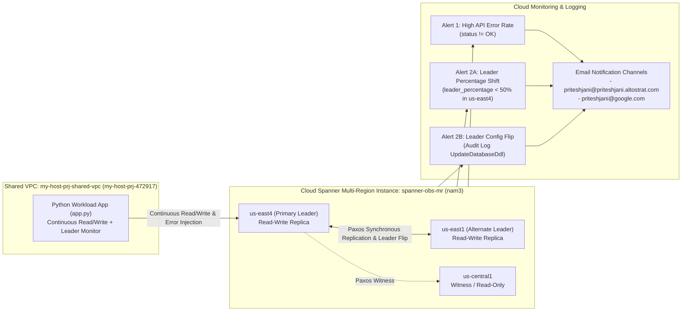

# Cloud Spanner Multi-Region Availability & Observability Demo (`spanner-observability`)

Complete demo suite for setting up **Google Cloud Spanner Multi-Region High Availability, Continuous Read/Write Application Traffic, and Proactive Cloud Monitoring Alerting** (API Error Rate Alerts & Multi-Region Leader Flip/Change Alerts).

---

## 1. Environment & Target Details

| Configuration Item | Value |
| :--- | :--- |
| **Project ID** | `my-host-prj-472917` |
| **Project Name** | `my-host-prj` |
| **VPC Network** | [`my-host-prj-shared-vpc`](https://console.cloud.google.com/networking/networks/details/my-host-prj-shared-vpc?project=my-host-prj-472917&organizationId=433637338589&orgonly=true&supportedpurview=organizationId) |
| **Spanner Instance ID** | `spanner-obs-mr` |
| **Multi-Region Config** | `nam3` (`us-east4` Read-Write Leader, `us-east1` Read-Write Failover Leader, `us-central1` Witness/Read-Only) |
| **Spanner Edition** | `ENTERPRISE_PLUS` (`1000` Processing Units) |
| **Database ID** | `finops-obs-db` |
| **Primary Leader Region** | `us-east4` (Northern Virginia) |
| **Alternate Leader Region** | `us-east1` (South Carolina) |
| **Email Notification Channels** | `priteshjani@priteshjani.altostrat.com`, `priteshjani@google.com` |
| **GitHub Repository** | [`https://github.com/priteshjani/spanner-observability`](https://github.com/priteshjani/spanner-observability) |

---

## 2. Architecture & Demo Scenarios



---

## 3. Repository Files

| Script / File | Description |
| :--- | :--- |
| [`config.env`](./config.env) | Central configuration file for `my-host-prj-472917`, `my-host-prj-shared-vpc`, `spanner-obs-mr`, `finops-obs-db`, and notification emails. |
| [`01_setup_spanner.sh`](./01_setup_spanner.sh) | Enables Spanner, Monitoring, Logging, and Compute APIs; verifies `my-host-prj-shared-vpc`; creates the `nam3` multi-region Spanner instance (`spanner-obs-mr`). |
| [`schema.sql`](./schema.sql) | DDL schema defining `Accounts`, interleaved `Transactions`, `TransactionsByCommittedAt` index, `HeartbeatLog`, and `default_leader = 'us-east4'`. |
| [`02_setup_database.sh`](./02_setup_database.sh) | Creates database `finops-obs-db`, sets `default_leader = 'us-east4'`, and seeds 5 initial enterprise accounts (`acct-0001` .. `acct-0005`). |
| [`03_setup_observability_alerts.sh`](./03_setup_observability_alerts.sh) | Creates email notification channels for `priteshjani@priteshjani.altostrat.com` and `priteshjani@google.com`, log-based metric `spanner_leader_change_events`, Alert Policy 1 (High Error Rate), Alert Policies 2A & 2B (Leader Flip), and the Spanner Observability Dashboard. |
| [`app.py`](./app.py) | Continuous Python read/write application supporting `--mode normal`, `--mode inject-errors`, and `--mode verify`, with automatic detection when `default_leader` changes. |
| [`requirements.txt`](./requirements.txt) | Python dependencies (`google-cloud-spanner`, `google-api-core`). |
| [`04_trigger_error_rate_scenario.sh`](./04_trigger_error_rate_scenario.sh) | **Scenario 1**: Injects failing Spanner API requests (`INVALID_ARGUMENT`, `NOT_FOUND`) alongside normal traffic for 120 seconds to fire the High Error Rate alert. |
| [`05_trigger_leader_flip_scenario.sh`](./05_trigger_leader_flip_scenario.sh) | **Scenario 2**: Flips the multi-region `default_leader` between `us-east4` and `us-east1` via `ALTER DATABASE ... SET OPTIONS (default_leader = ...)` to trigger the Leader Flip alerts. |
| [`06_validate_all.sh`](./06_validate_all.sh) | Runs end-to-end verification across the Spanner instance, database leader option, email channels, alert policies, and a live read/write probe. |
| [`07_cleanup.sh`](./07_cleanup.sh) | Deletes the alert policies, log-based metric, and multi-region Spanner instance after the demo. |
| [`08_push_to_git.sh`](./08_push_to_git.sh) | Commits and pushes all files to `https://github.com/priteshjani/spanner-observability.git`. |

---

## 4. Step-by-Step Instructions to Run the Demo

### Step 1: Provision Multi-Region Spanner Instance (`nam3`)
```bash
./01_setup_spanner.sh
```

### Step 2: Create Database, Configure `default_leader` & Seed Accounts
```bash
./02_setup_database.sh
```

### Step 3: Setup Email Notification Channels, Alert Policies & Dashboard
```bash
./03_setup_observability_alerts.sh
```
> **Important**: Confirm the verification email sent by Google Cloud Monitoring to **`priteshjani@priteshjani.altostrat.com`** and **`priteshjani@google.com`**.

### Step 4: Start the Continuous Read/Write Application (Terminal 1)
Keep this running throughout the demo to generate continuous read/write load and watch live leader status:
```bash
python3 -m venv .venv
.venv/bin/pip install -r requirements.txt
.venv/bin/python app.py --mode normal
```
Sample output:
```text
[INIT] Connected to Spanner. Current configured default_leader = 'us-east4'
[2026-09-20T11:30:01Z] iter=1 | leader=us-east4 | READ=8.4ms | WRITE=14.2ms | ok=2 err=0
[2026-09-20T11:30:02Z] iter=2 | leader=us-east4 | READ=7.9ms | WRITE=13.8ms | ok=4 err=0
```

### Step 5: Execute Scenario 1 — Spanner Instance Error Rate Alert (Terminal 2)
Run the error injection script to generate non-OK Spanner API responses (`spanner.googleapis.com/api/request_count` with `status != "OK"`):
```bash
./04_trigger_error_rate_scenario.sh 120
```
* **Expected Result**:
  * Cloud Monitoring detects non-OK Spanner API rate exceeding threshold.
  * Incident opens for **`[Spanner Observability] High API Error Rate - spanner-obs-mr`**.
  * Email alert is delivered to `priteshjani@priteshjani.altostrat.com` and `priteshjani@google.com`.

### Step 6: Execute Scenario 2 — Multi-Region Leader Flip / Change Alert (Terminal 2)
Flip the multi-region database leader from `us-east4` to `us-east1` (or back):
```bash
./05_trigger_leader_flip_scenario.sh
```
* **Expected Result**:
  1. `default_leader` in `INFORMATION_SCHEMA.DATABASE_OPTIONS` flips from `us-east4` to `us-east1`.
  2. Terminal 1 (`app.py`) automatically prints:
     ```text
     [ALERT - LEADER FLIP DETECTED] Database 'finops-obs-db' default_leader flipped from 'us-east4' ---> 'us-east1'!
     ```
  3. Cloud Monitoring fires **`[Spanner Observability] Multi-Region Leader Flip (Audit & Telemetry) - spanner-obs-mr`** (immediately upon DDL/config change) and **`[Spanner Observability] Multi-Region Leader Flip (Metric Shift) - spanner-obs-mr`** (as `spanner.googleapis.com/instance/leader_percentage` shifts from `us-east4` to `us-east1`), emailing both notification channels.

### Step 7: Validate Full Stack
```bash
./06_validate_all.sh
```

### Step 8: Tear Down After Demo
```bash
./07_cleanup.sh
```
